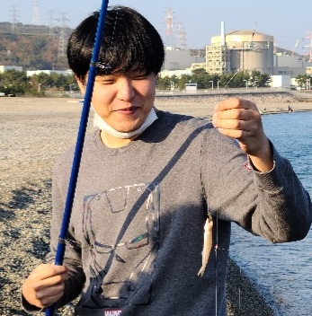

---
# the default layout is 'page'
icon: fas fa-info-circle
order: 4
---

# ABOUT ME
---

  

    
  

  

    Name.
    이희도
    Now.
    사회복무요원하면서 개발공부
    Specialty.
    FW(Atmel), MODELING(INVENTOR), AI(Tensorflow)    
    Hobby.
    싸이클, 낚시, 변수명 짓기, 뻘짓하기
    Contact.
    Email: 
    j3jjj2021@naver.com
    Channel.
    Github: 
    <A href="https://github.com/leehuido-git" style="font-size:1.2rem; font-weight:bold"> LEEHUIDO-GITHUB! </A>
  

# START
---
